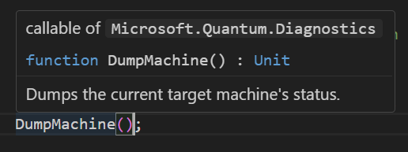
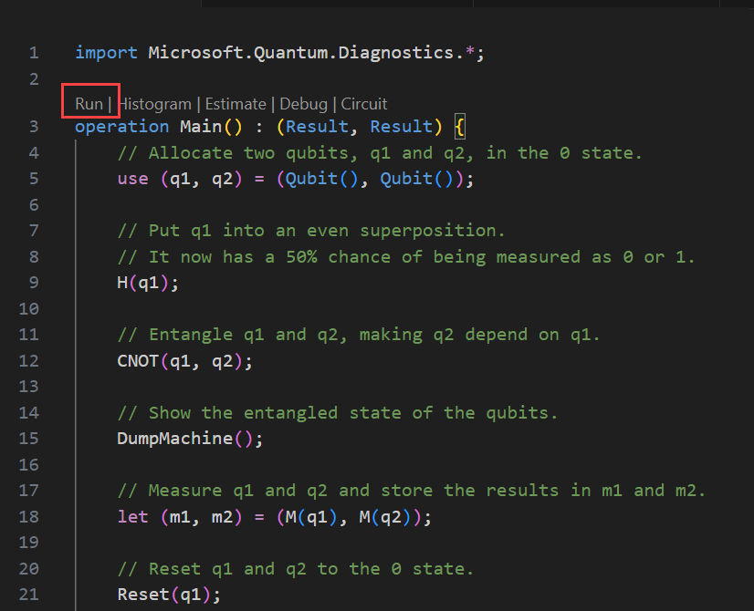

# Quickstart: Create your first Q# program

Learn how to write a basic Q# program that demonstrates entanglement, a key concept of quantum computing.

When two or more [qubits](xref:microsoft.quantum.concepts.qubit) are entangled they're sharing quantum information, which means that whatever happens to one qubit also happens to the other. In this Quickstart, you'll create a particular entangled pair of qubits called a Bell pair. In the Bell pair, if you measure one of the qubits in the $\ket{0}$ state, you know that the other qubit is also in the $\ket{0}$ state without measuring it. For more information, see [Quantum entanglement](xref:microsoft.quantum.concepts.entanglement).

In this quickstart, you:

> [!div class="checklist"]
> - Create a Q# file.
> - Allocate a pair of qubits.
> - Entangle the qubits.

## Prerequisites

- The latest version of [Visual Studio Code](https://code.visualstudio.com/download).
- The [Azure Quantum Development Kit (QDK) extension](https://marketplace.visualstudio.com/items?itemName=quantum.qsharp-lang-vscode). For installation details, see [Set up the QDK](xref:microsoft.quantum.install-qdk.overview).

## Create a Q# file

1. Open Visual Studio Code.
1. Select **File** > **New Text File**.
1. Save the file as `Entanglement.qs`. The .qs extension denotes a Q# program.

## Write your Q# code

In your `Entanglement.qs` file, follow these steps to entangle and measure a pair of qubits.

### Define a namespace

Each Q# program starts with a user-defined namespace, which helps you organize related functionality. For this quickstart, your namespace is `BellPair`:

```qsharp
namespace BellPair {
    // Your code goes here.
}
```

### Open a quantum library

The QDK includes the Q# standard library with predefined functions and operations for your quantum programs. To use them, you must first open the relevant library.

In your `BellPair` namespace, use an `open` statement to import the `Microsoft.Quantum.Diagnostics` library. This gives you access to all its functions and operations, including `DumpMachine()`, which you later use to display the entangled state.

```qsharp
    open Microsoft.Quantum.Diagnostics;
```

### Define an operation

After opening the `Microsoft.Quantum.Diagnostics` library, define an operation named `EntangleQubits`. This is where you'll write the remaining Q# code to allocate, manipulate, and measure two qubits.

`EntangleQubits` takes no parameters and returns two `Result` values, `zero` or `one`, which represent the result of the qubit measurements:

```qsharp
    operation EntangleQubits() : (Result, Result) {
        // Your entanglement code goes here.
}
```

### Allocate two qubits

The `EntangleQubits` operation is currently empty, so the next step is to allocate two qubits, `q1` and `q2`. In Q#, to allocate a qubit you use the `use` keyword:

```qsharp
        // Allocate two qubits, q1 and q2, in the zero state
        use (q1, q2) = (Qubit(), Qubit());
```

> [!NOTE]
> In Q#, qubits are always allocated in the $\ket{0}$ state.

### Put the first qubit into superposition

Qubits `q1` and `q2` are both in the $\ket{0}$ state. To prepare the qubits for entanglement, you must put one of them into an even superposition, where it has a 50% chance of being measured as $\ket{0}$ or $\ket{1}$. 

You put a qubit into superposition by applying the Hadamard, `H`, operation:

```qsharp
        // Put q1 into an even superposition.
        H(q1);
```

### Entangle the qubits

You're now ready to entangle the qubits using the controlled-NOT, `CNOT`, operation. The `CNOT` is a control operation that takes two qubits, one acts as control qubit and the other is the target qubit. For this quickstart, you set `q1` as the control qubit and `q2` as the target qubit. 
The `CNOT` operation flips the state of  `q2`, the target qubit, if the state of `q1`, the control qubit, is $\ket{1}$.

```qsharp
        // Entangle q1 and q2, making q2 depend on q1.
        CNOT(q1, q2);
```
The resulting state of both qubits is the Bell pair $\frac{1}{\sqrt{2}}(\ket{00}+\ket{11})$.

>[!TIP]
> If you want to learn how the Hadamard and CNOT operations transform the state of the qubits, see [Creating entanglement with quantum operations](xref:microsoft.quantum.concepts.entanglement#creating-entanglement-with-quantum-operations).

### Display the entangled state

Before measuring the qubits, it's important to verify that your previous code successfully entangles them. You can use the `DumpMachine` operation, which is part of the `Microsoft.Quantum.Diagnostics` library, to output the current state of your Q# program:

```qsharp
        // Show the entangled state of the qubits.
        DumpMachine();
```

### Measure the qubits

Now that you verified the qubits are entangled, you can use the `M` operation to measure them. Measuring `q1` and `q2` collapses their quantum states into `zero` or `one` with even probability.
In Q# you use the `let` keyword to declare a new variable. To store the results of measuring `q1` and `q2`, you declare a the variables `m1` and `m2`, respectively:
```qsharp
        // Measure q1 and q2 and store the results in m1 and m2.
        let (m1, m2) = (M(q1), M(q2));
```

### Reset the qubits

Before being released at the end of each Q# program, qubits must be in the $\ket{0}$ state. You do this using the `Reset` operation:

```qsharp
        // Reset q1 and q2 to the 0 state.
        Reset(q1);
        Reset(q2);
```

### Return the measurement results

Finally, to complete the `EntangleQubits` operation and observe the entangled state, return the measurement results of `m1` and `m2`:

```qsharp
        // Return the classical results.
        return (m1, m2);
```

> [!TIP]
> If you want to learn more about a Q# function or operation, hover over it.
>
>

## Run your Q# code

You've written a Q# program that entangles two qubits and creates a Bell pair. Before running your program, use the `@EntryPoint()` attribute to tell the Q# compiler where to start executing the program. Every Q# program must contain one `@EntryPoint()` attribute. In this case, place `@EntryPoint()` before the `EntangleQubits` operation.

Your final Q# program should look like this:

```qsharp
namespace BellPair {
    open Microsoft.Quantum.Diagnostics;
        
    @EntryPoint()
    operation EntangleQubits() : (Result, Result) {  
        // Allocate two qubits, q1 and q2.
        use (q1, q2) = (Qubit(), Qubit());

        // Put q1 into an even superposition.
        // It now has a 50% chance of being measured as 0 or 1.
        H(q1);

        // Entangle q1 and q2, making q2 depend on q1.
        CNOT(q1, q2);

        // Show the entangled state of the qubits.
        DumpMachine();

        // Measure q1 and q2 and store the classical results in m1 and m2.
        let (m1, m2) = (M(q1), M(q2));

        // Reset q1 and q2 to the 0 state.
        Reset(q1);
        Reset(q2);

        // Return the classical results.
        return (m1, m2);
    }
}
```

Under `@EntryPoint()`, select **Run** to view the result of both qubits. You can run the program several times, each with a different result in the debug console. This demonstrates the probabilistic nature of quantum measurements and the entanglement of the qubits.



## Next step

To learn more about quantum entanglement with Q#, see [Tutorial: Explore quantum entanglement with Q#](xref:microsoft.quantum.tutorial-qdk.entanglement). This tutorial expands on the concepts covered in this quickstart and helps you write a more advanced entanglement program.
